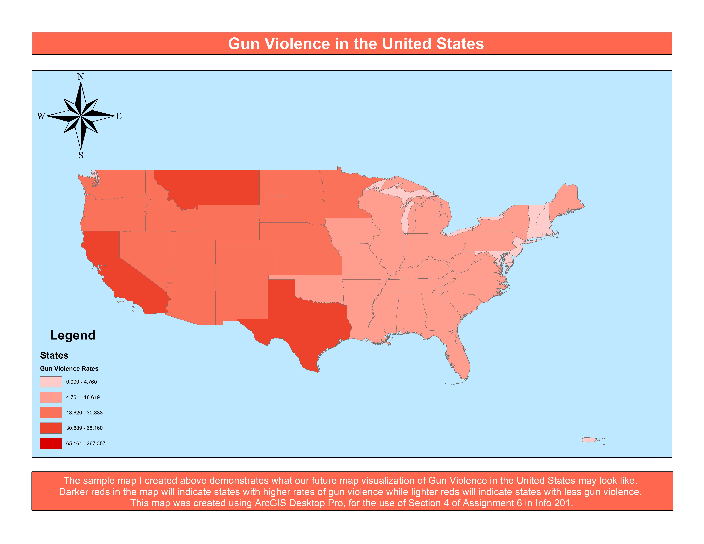

```{r setup, include = FALSE}
# Load results from the analysis
library(knitr)
library(dplyr)
source("analysis.R")
```

## **Section 1: Problem Domain Description**

**Gun Violence** in the United States is becoming more and more apparent year after year. It has become _common_ to hear about a brand new mass shooting or tragedy involving gun use. For this reason, we decided to focus our research on identifying areas of the United States experiencing large amounts of gun affiliated criminal incidents along with the correlation between race and gun use. By doing so, we hope to draw attention to these areas experiencing this terrifying trend of gun use in our nation so that our audience can understand where these incidents are occurring and maybe even be inspired to vote or act in a way that helps to mitigate gun use.

To achieve this goal, we found two datasets. The first dataset contains information on gun-related criminal incidents by State and County across multiple years, in other words, crimes involving gun use such as a robbery, murder, assault, etc. To analyze the correlation between race and gun use, we found a dataset including the percentage of people who are white, black, hispanic, etc in each state of the United States (More details on these datasets in Section 2).

### Section 1.1: Critical Analysis Questions

1. Which state had the highest number of gun related criminal incidents in 2017?
  - This question is of interest to us because it allows us to identify the state within the United States of America which experienced the most frequent gun related            criminal incidents in 2017 so that we have an understanding of which areas in the US need the most help regarding mitigating these gun related criminal incidents through     gun control laws or through stricter background checks. Our dataset on the number of gun related criminal incidents will be very useful at answering this question, since     the dataset contains row after row of gun related criminal incidents in 2017 per state. Therefore, we can calculate this maximum number needed to identify the state with     the highest number of gun related criminal incidents in 2017.
  
2. Which state had the lowest number of gun related criminal incidents in 2017?
  - This question is of interest because, by identifying the state with the lowest number of gun related criminal incidents in 2017, we can compare and contrast the gun         control systems this state has in place with the systems the state with the most frequent gun related criminal incidents has in place. In this way, we can identify what     approaches to gun control work to mitigate shootings in the US. Our dataset on the number of gun related criminal incidents will be very useful at answering this            question, since the dataset contains row after row of gun related criminal incidents in 2017 per state. Therefore, we can calculate this minimum number needed to            identify the state with the lowest number of gun related criminal incidents in 2017.
  
3. Which caliber of gun is most often used in all shootings/mass shootings in the United States?
  - By identifying the caliber of weapon most frequently used in shootings in the United States, an argument can be made to apply stricter regulations on that caliber of        weapon so that criminals or people with malicious intent will have a harder time at acquiring such a weapon to use in their evil acts of shooting. Our dataset on gun        related criminal incidents in the United States per state, identifies the caliber of weapon used in each incident, therefore we can use the dataset to find the caliber      of weapon most frequently used in shootings in the United States.
  
4. What is the relationship between race and gun related criminal incidents in the United States?
  - We will merge our dataset on the percentages of each race located in each state with our gun related criminal incidents dataset to compare and contrast how race affects     the number of gun related incidents per state. This is of interest to us because by identifying patterns/correlations between race and gun violence, we can begin to         analyze some of the social or economic factors that affect people from differing cultures in these states that may play a role in the rise or fall of gun related            criminal incidents.

## **Section 2: Data Description**

### Gun Violence Data Description

The first data contains the details about each gun violence incident in United States from January 2013 to March 2018. We are particularly interested in the state, casualities, and caliber columns.

The data is originally from [Gun Violence Archive's website (GVA)](https://www.gunviolencearchive.org/). It is a nonprofit corporation that provides free online accurate data on gun-related violence in the U.S. GVA collects comprehensive information, checks for accuracy, and publishes them online. Afterwards, we downloaded the data from a [gun violence repo by jamesqo](https://github.com/jamesqo/gun-violence-data/blob/master/README.md) who wrangled the data.

```{r small_gun_frame, echo=FALSE}
small_2017_gun_frame <- kable(small_2017_gun_incidents)
```

`r small_2017_gun_frame`

### List of each columns we care about

- year: the year the gun incidents take place
- state: the state the gun incidents occur
- n_killed: the number of people killed in an incident
- n_injuried: the number of people injuried in an incident
- gun_type: the type of gun used in each incidents

### Race by States Data Description

The second data contain the ratios of race distribution in each state, including white, black, hispanic, and Asian.

Kaiser Family Foundation estimated this data based on the Census Bureau's American Community Survey. All numbers in this data is rounded to the nearest 100th, and all N/A data are those with relative standard errors greater than 30% to prevent biases. The link to the data can be found [here](https://www.kff.org/other/state-indicator/distribution-by-raceethnicity/?currentTimeframe=0&sortModel=%7B%22colId%22:%22Location%22,%22sort%22:%22asc%22%7D).

```{r race_dataset, echo=FALSE}
race_data_2017_kable <- kable(race_data_2017)
```

`r race_data_2017_kable`

### List of each columns

- Location: Each states in U.S.
- White: The ratio of white Americans in that state
- Black: The ratio of African Americans in that state
- Hispanic: The ratio of Hispanic Americans in that state
- Asian: The ratio of Asian Americans in that state
- Total: The total ratio of the four groups of Americans combined in that state


## **Section 3: Preliminary Analysis**

1. After our analysis of gun related incidents per state, we found that Florida had the largest number of gun related criminal incidents with **631** criminal incidents involving guns in 2017.

2. After our analysis of gun related incidents per state, we found that Hawaii had the lowest number of gun related criminal incidents with **5** criminal incidents involving guns in 2017.

3. After our analysis on the caliber of guns used most frequently in gun related criminal incidents in 2017, we found that **9mm** weapons are most often used. This is likely due to how cheap 9mm weapons are in relation to the other calibers of guns. A bar chart of the distribution of calibers used most frequently in gun related criminal incidents is provided below in our Visualization Section.

4. We merged our two datasets to create a scatter plot of the relationship between race and gun violence. For our sample visualization we only included **White** as our race and the total number of gun related criminal incidents per state. You can view our scatterplot at the bottom of our report.


## **Section 4: Visualization Proposal**

**Question 1 & 2**: Which two states had the highest and lowest numbers of gun related criminal incidents in 2017 respectively?

- Visualization: A U.S. map uses color encoding by lightness to show the numbers of gun related criminal incidents in each state.
- Explanation: We can tell from the map which part of United States has more/less gun related criminal incidents in 2017.



**Question 3**: What's the most used calibers in all shootings/mass shootings?

- Visualization: Bar chart with top 5 most used calibers, adjust intervals accordingly
- Explanation: The position encoding on bar chart enables us to identify the most used calibers when the numbers are really close.

**Analysis result: Occurrence of different calibers in shoootings from 2013 to 2018**<p>
In our data of all shootings occured, **`r total_valid_occurence`** incidents have valid documentation about the caliber of the weapon involved. The following bar chart shows the amount of different firearm calibers involved in these incidents:<p>
```{r bar-chart, echo = FALSE} 
ggplot(data = list, aes(factor(caliber_3))) +
  geom_bar() +
  theme(axis.text.x = element_text(angle = 70, hjust = 1))

```
<p>
**Possible error:**
<p>
However, a rough look at the data reviews a possible error: in the original data, the author included a cartridge type as __"7.62 [AK-47]"__ and another cartridge as __"308 Win"__. As a result of such, it's reasonable to assume the author means __"7.62 * 39"__ by __"7.62 [AK-47]"__, and counts __7.62 * 51 NATO__ as __"308 Win"__. 
<p>
In the final data, it is shown that involvement of __"7.62 * 39"__ largely exceeds that of __"308 Win"__. However, a rough research on US civilian ammo sale data show that these two cartridges have similar sales, and the difference of price doesn't seem to count for the large margin in the bar chart. My assumptions are: it mgiht be that the original data actually confused both 7.62 * 51 NATO and 7.62*39 rounds as "7.62 [AK-47]"; or that US civilian market sees a huge amount of AKs that uses 7.62*39. To prove/disprove either assumption, I would suggest finding data on sales of cartridge /firearm by caliber and build scatter plot and find least square regression and see how correlation coefficient suggests about how strong the correlation between them and involvement in shootings is.
<p>
<p>
**A Quick Note:**<p>
[**7.62 * 39**](https://en.wikipedia.org/wiki/7.62%C3%9739mm) is a rimless, bottlenecked, centerfire rifle cartridge developed by soviet union. in US civiliian market it's mostly seen used by AK-47 and SKS series rifles. <p>
[**7.62 * 51 NATO** ](https://en.wikipedia.org/wiki/7.62%C3%9751mm_NATO) is a rifle round developed for NATO nations, and used by rifles such asM14, FN FAL, and FN Scar; [**.308 Win**](https://en.wikipedia.org/wiki/.308_Winchester) is the commercial version of  7.62 * 51 NATA, used in USA by a wide range of rifles. The two cartridges are similar and can sometimes be interchangeable. <p>
Also, I believe that original data counted **5.56 * 45** NATO as **.223 Remington**, two cartridges with similar relations as the other two stated above.
<p>


**Question 4**: How does race impact gun related criminal in each state?

- Visualization: Construct 4 scatter plots (1 race each) with x coordinate representing the percentage of race in each state and with y coordinate representing the gun related incidents. Use four colors (white, brown (Hispanic), black (African), and yellow (Asian)) for the respective scatter plot's 51 data points (one for each state) and constructs a regression line in each one. For our rough sketch we only included the first scatter plot regarding the White race.
- Explanation: The color encoding enables us to tell the differences among races and the position encoding of scatter plots shows the correlation between two variables (race percentage and number of gun related incidents)

```{r scatter-plot, echo = FALSE}
ggplot(data = combined_race_and_state_dataset, aes(x = combined_race_and_state_dataset$White, y = combined_race_and_state_dataset$total_gun_incidence)) +
  geom_point()
```
